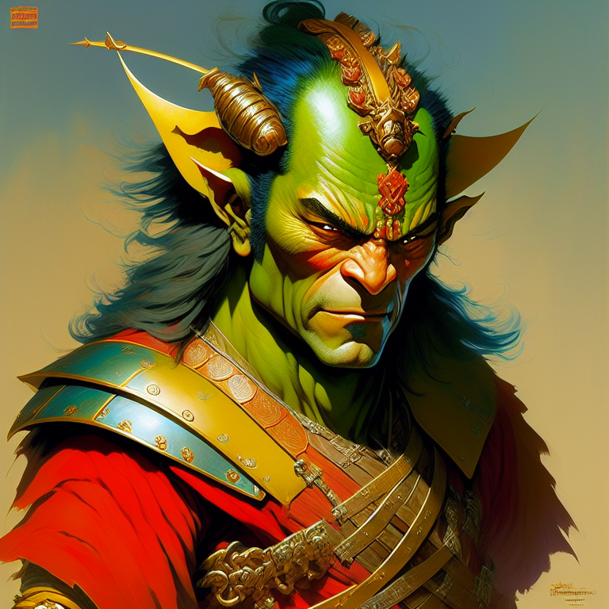

## `color-supreme`

A powerful library for extracting dominant colors from images. Color-Supreme uses the k-means clustering algorithm to analyze the colors in an image and identify the most dominant ones, making it ideal for a range of applications such as image processing, data visualization, and search algorithms.

## Get started

### Install

```bash
yarn add color-supreme
# or
npm install --save color-supreme
```

### Use

Browser

```typescript
import { getDominantColors, getPixelsCanvas, rgbToHex } from 'color-supreme'

const getColors = async (url: string, colors = 5) => {
  const pixels = await getPixelsCanvas(url)
  return getDominantColors(pixels, colors).map(rgbToHex)
}

getColors('your image url').then(console.log)
```

Node (example with sharp)

```typescript
import sharp from 'sharp'
import { getDominantColors, imageToPixels, rgbToHex } from 'color-supreme'

const getColors = async (path: string, colors = 5) => {
  const { data, info } = await sharp(path)
    .raw()
    .toBuffer({ resolveWithObject: true })
  const pixels = imageToPixels(data, info.width!, info.height!)

  return getDominantColors(pixels, colors).map(rgbToHex)
}

getColors('your image path').then(console.log)
```

<!-- START GENERATED CONTENT -->

  
  <span style="color:#a69418; font-size:40px">■</span>
  <span style="color:#232123; font-size:40px">■</span>
  <span style="color:#766c78; font-size:40px">■</span>
  <span style="color:#16a896; font-size:40px">■</span>
  <span style="color:#cfbfcd; font-size:40px">■</span>
  

  
  <span style="color:#c2193e; font-size:40px">■</span>
  <span style="color:#c4c4c4; font-size:40px">■</span>
  <span style="color:#3fc219; font-size:40px">■</span>
  <span style="color:#1c1c1c; font-size:40px">■</span>
  <span style="color:#1a3fc1; font-size:40px">■</span>
  

  
  <span style="color:#292829; font-size:40px">■</span>
  <span style="color:#8d5db2; font-size:40px">■</span>
  <span style="color:#7e8575; font-size:40px">■</span>
  <span style="color:#575959; font-size:40px">■</span>
  <span style="color:#c0cdbb; font-size:40px">■</span>
  

  
  <span style="color:#397238; font-size:40px">■</span>
  <span style="color:#c7c8c7; font-size:40px">■</span>
  <span style="color:#373972; font-size:40px">■</span>
  <span style="color:#723839; font-size:40px">■</span>
  <span style="color:#818281; font-size:40px">■</span>
  
<!-- END GENERATED CONTENT -->

---

## License

`color-supreme` is open source software released under the MIT license. See the LICENSE file for more information.

I hope you enjoy using `color-supreme` and find it useful in your projects. If you have any questions or feedback, please don't hesitate to reach out.
